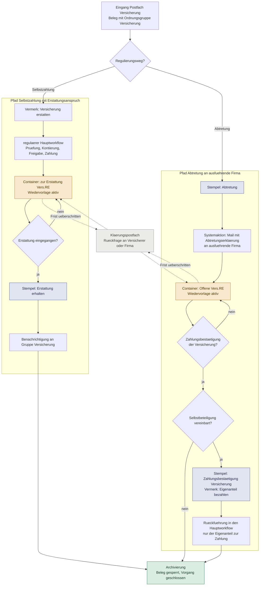
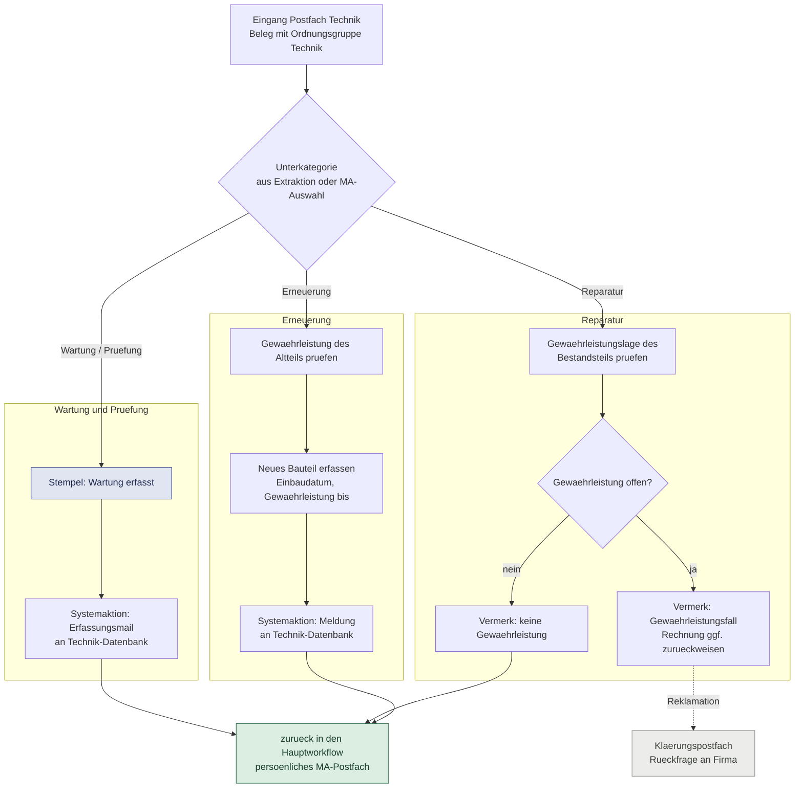

# DMS für die Immobilienverwaltung — Gesamtkonzept

*Architektur, Datenmodell, Module, Entscheidungen, offene Punkte*

Stand: 26. August 2026 · Zielgröße 500 Objekte, ~25.000 Belege/Jahr
Grundlage: PostgreSQL 16 / Supabase · Schema getestet gegen 1.000.000 Dokumente

---

## Inhalt


**Teil A · Rahmen**

1. Ziel und Ausgangslage
2. Modulübersicht
3. Leitentscheidungen

**Teil B · Datenmodell**

4. Stammdaten
5. Dokumentenkern
6. Kontierung mit Split
7. Einheit, Person und zeitbezogene Belegeinsicht

**Teil C · Prozesse**

8. Workflow-Engine
9. Ablaufdiagramm: Hauptlauf
10. Nebenläufe der Spezialgebiete
11. Ablaufdiagramme: Nebenläufe
12. Zahlungsübergabe

**Teil D · Erkennung und Vertrauen**

13. Verarbeitungspipeline
14. Ampel
15. Lernspeicher

**Teil E · Sicherheit, Sichtbarkeit, Archiv**

16. Layer: Stempel, Anmerkungen, Schwärzung
17. Berechtigungen und externe Einsicht
18. Sichtbarkeit am Beleg
19. Archivierung, Aufbewahrung, Übergabe
20. Externe Datenquellen

**Teil F · Nachweise und Ausblick**

21. Messung statt Annahme
22. Entscheidungsprotokoll
23. Vorgeschlagene Umsetzungsreihenfolge
24. Offene Punkte

---

# Teil A · Rahmen


## 1. Ziel und Ausgangslage

Ersatz für Amagno durch eine Eigenentwicklung, zugeschnitten auf die Immobilienverwaltung. Betreibbar als eigenständige Anwendung oder als Modul einer bestehenden Verwaltungssoftware.

**Zielgröße:** 500 Objekte, rund 25.000 Belege im Jahr, etwa 50 Belege je Objekt und Jahr.

**Was den Anstoß gab.** Amagno arbeitet mit PDF-Dateien und wird dabei langsam. Die Diagnose fiel anders aus als die Vermutung: Nicht das Format ist der Engpass, sondern der Zeitpunkt der Verarbeitung. Wenn Aufbereitung und Anzeige getrennt werden — OCR, Extraktion und Vorrendern beim Eingang, beim Öffnen nur noch ein vorbereitetes Bild — verschwindet das Problem. Die eigentliche Motivation liegt anderswo: Der Workflow soll ohne Fachkenntnis änderbar sein.

**Was übernommen wird.** Der bestehende Ablauf ist erprobt und den Mitarbeitern vertraut. Stempelnamen, Postfächer, Ordnungsgruppen und Nebenläufe bleiben, wie sie sind. Ersetzt wird ausschließlich die Mechanik darunter.

**Was anders wird.**

| | Bestand | Neu |
|---|---|---|
| Weiterleitung | Stempel ist mit Zielmagnet verdrahtet | Stempel trägt nur die Entscheidung, die Engine leitet weiter |
| Erkennung | Magnete, manuell gepflegt | KI-Extraktion mit Fundstelle, positionsunabhängig |
| Zuordnung | Regeln nachpflegen | Lernspeicher aus bestätigten Zuordnungen |
| Änderung | Stempel umhängen | Zeile in einer Tabelle |
| Vertrauen | erkannt oder nicht | zwei Werte: Extraktion und Plausibilität, Ampel daraus |

---

## 2. Modulübersicht

Neun Bausteine, jeder für sich austauschbar:

| Baustein | Aufgabe | Kernabschnitt |
|---|---|---|
| **Eingang und Aufbereitung** | Import, Dublettenprüfung, OCR, Seitentext, Vorrendern | D |
| **Erkennung** | KI-Extraktion mit Confidence und Fundstelle, ZUGFeRD-Pfad | D |
| **Lernspeicher** | Objekt- und Kontierungsvorschläge aus bestätigten Zuordnungen | D |
| **Workflow-Engine** | Stufen, Aufgaben, Stempelereignisse, Klärung, Eskalation | C |
| **Kontierung** | Splitzeilen, Umlagefähigkeit, § 35a, Rücklage, Beschlussbezug | B |
| **Zahlung** | konfigurierbare Zahlungswege, Lastschrift-Ausnahme | C |
| **Archiv** | Sperre, PDF/A, Hash, Object Lock, Aufbewahrungsfristen | E |
| **Einsicht** | befristete, gefilterte Belegeinsicht für Eigentümer, Beirat, Mieter | E |
| **Konfiguration** | Stufenfolgen, Stempelrechte, Ordnungsgruppen, Grenzen — als Stammdaten | C |

Dazu eine **Adapterschicht** für Stammdaten (Objekte, Kontenrahmen), Fremdsysteme (Technik-Datenbank, Hausbank) und den KI-Provider. Sie ist der Grund, warum dieselbe Codebasis eigenständig und als Modul laufen kann.

---

## 3. Leitentscheidungen

| # | Entscheidung | Begründung |
|---|---|---|
| 1 | **Ein generischer Dokumentenkern**, fachliche Daten in Satellitentabellen | Kein zweites Modul für Schriftverkehr; ein Posteingang, ein Rechtemodell, ein Audit-Log |
| 2 | **Stempel sind Ereignisse, Status ist abgeleitet** | Append-only-Kette erfüllt gleichzeitig GoBD-Protokollpflicht |
| 3 | **Original wird nie verändert** — Stempel, Anmerkungen, Schwärzungen liegen als Layer daneben | Integrität nach GoBD/ISO; Export wahlweise mit oder ohne Layer |
| 4 | **Zwei getrennte Vertrauenswerte**: Extraktion vs. Plausibilität | „IBAN weicht ab" ist ein anderer Fall als „Betrag unscharf gelesen" |
| 5 | **Freigabe-Hash** bindet Stempel an den Datenstand | Ändert sich ein freigaberelevantes Feld, verfallen die Stempel automatisch |
| 6 | **Lernen strikt mandantenbezogen** | Kein übergreifender Lieferantenpool |
| 7 | **Adapter für Stammdaten und KI-Provider** | Standalone-Betrieb und Modulbetrieb aus derselben Codebasis |
| 8 | **Bestehender Amagno-Ablauf wird nachgebildet, nicht neu erfunden** | Stempelnamen, Postfächer und Nebenläufe bleiben vertraut; ersetzt wird nur die Mechanik darunter |

---

---

# Teil B · Datenmodell


## 4. Stammdaten

```
mandant

objekt                    id, mandant_id, objektnummer, bezeichnung, adresse,
                          verwaltungsart (weg|miet|se), wirtschaftsjahr_beginn,
                          kontenrahmen_id,
                          standard_ordnungsgruppe_id, spezialgebiet_id,
                          eskalationsgrenze_brutto, zahlungsweg_id,
                          externe_id, sync_quelle, sync_stand
                          -- liefert das, was der Posteingangsstempel
                          -- per Klick-Fuellen setzt

objekt_zustaendigkeit     objekt_id, benutzer_id,
                          art (hauptverantwortlich|vertretung),
                          gueltig_von, gueltig_bis

spezialgebiet             mandant_id, name (Versicherung, Technik, Legal, …), aktiv
                          -- im Bestand: "Fachgebiet"; Begriff aus Amagno uebernommen

spezialgebiet_zustaendigkeit  spezialgebiet_id, benutzer_id|gruppe_id,
                          objekt_id NULL = mandantenweit

benutzer / gruppe / gruppe_mitglied

kreditor                  mandant_id, name, ust_id, steuernummer,
                          externe_id, status
kreditor_bankverbindung   kreditor_id, iban, status (verifiziert|neu|gesperrt),
                          erstmals_gesehen, bestaetigt_von, bestaetigt_am

vertrag                   kreditor_id, objekt_id, bezeichnung, turnus,
                          erwarteter_betrag, toleranz_prozent,
                          zahlungsart (ueberweisung|lastschrift),
                          naechste_erwartung, aktiv

kontenrahmen / konto      kontonummer, bezeichnung,
                          umlagefaehig_default, umlageschluessel_default,
                          ordnungsgruppe_default, ist_ruecklage, aktiv

umlageschluessel          MEA, Wohnfläche, Einheiten, Personen, Verbrauch, …

ordnungsgruppe            mandant_id, name, kurzcode, sortierung, farbe,
                          aktiv, fachgebiet_id NULL,
                          prozessdefinition_id NULL,
                          konto_vorschlag_id NULL,
                          ki_beschreibung           ← in Einstellungen pflegbar

belegmerkmal              mandant_id, name, aktiv          ← frei erweiterbar
                          (umlagefähig, Dauerakte, § 35a-relevant, …)

bauteil                   objekt_id, bezeichnung, einbau_am, lieferant_id,
                          gewaehrleistung_bis, ersetzt_bauteil_id, aktiv
                          -- Grundlage der Gewaehrleistungspruefung

beschluss                 objekt_id, datum, bezeichnung, budget,
                          wirtschaftsjahr
wirtschaftsplan_position  objekt_id, wirtschaftsjahr, konto_id, budget,
                          warnschwelle_prozent
```

### Ordnungsgruppe

Bestand: *Betr. Kosten, Legal, Versicherungsschäden, Versicherungsprämien, Technik*. Erweiterbar über die Einstellungen, **eindeutig pro Beleg** — Fremdschlüssel am Dokument, kein n:m.

Die Ordnungsgruppe ist nicht nur Ablagemerkmal, sondern **Steuergröße des Workflows**:

- `spezialgebiet_id` lenkt die Zuständigkeit. „Versicherungsschäden" und „Legal" gehen an den Spezialisten, obwohl das Objekt beim Objektbearbeiter bleibt.
- `prozessdefinition_id` erlaubt je Gruppe eine eigene Stufenfolge. Die Prozessdefinition wird damit auf das Paar (Belegart, Ordnungsgruppe) geschlüsselt.
- `ki_beschreibung` ist ein Satz Freitext je Gruppe, der in den Extraktions-Prompt eingebettet wird — z. B. „Versicherungsprämien: wiederkehrende Beiträge an Versicherer, Gebäude-, Haftpflicht-, Elementarversicherung; keine Schadensregulierung". Damit funktioniert der KI-Vorschlag für eine neu angelegte Gruppe ab dem nächsten Beleg, ohne Eingriff in den Code.

**Umgruppierung bleibt möglich, auch nach der Archivierung.** Die Ordnungsgruppe steuert Zuständigkeit und Ablage, nicht die Buchung — eine Korrektur ist deshalb kein Eingriff in den Beleg. Sie läuft über eine eigene Aktion mit Begründungspflicht und schreibt ein Ereignis ins Protokoll; das Dokument selbst und alle Stempel bleiben unberührt.

**Kein Löschen, nur Deaktivieren** — sobald Belege zugeordnet sind, wäre eine Löschung ein Bruch in der Historie. Umbenennen ist unkritisch, da die ID bleibt. Für das Zusammenführen zweier Gruppen braucht es eine eigene Funktion mit Nachlauf über alle betroffenen Dokumente und Protokolleintrag.

Ergänzungsvorschläge aus der Praxis: *Verwaltung/Allgemein* (Verwaltervergütung, Kontoführung, Porto — passt in keine der fünf), *Erhaltung/Instandsetzung* als Abgrenzung zu „Technik" (Technik = Wartung und laufender Betrieb, Erhaltung = Reparatur mit Rücklagenbezug; die Trennung brauchst du für § 35a und die Rücklagenentnahme), *Modernisierung/Bauliche Veränderung* (§ 20 WEG, gesonderte Kostenverteilung) sowie *Ver-/Entsorgung* (Heizkosten, Wasser, Müll — Grundlage der Heizkostenabrechnung).

---

---

## 5. Dokumentenkern

```
dokument              id, mandant_id, objekt_id, vorgang_id,
                      belegart (rechnung|gutschrift|mahnung|schriftverkehr|…),
                      ordnungsgruppe_id,
                      eingangskanal, eingang_am, erfasst_von,
                      seitenzahl, inhalt_hash,
                      ampel_extraktion, ampel_plausibilitaet, ampel_gesamt,
                      dublette_von, storage_praefix

dokument_datei        dokument_id, variante, storage_key, mime, groesse, hash
                      variante ∈ original | email_eml | zugferd_xml |
                                 pdfa_derivat | ansicht_webp | export_derivat

dokument_seite        dokument_id, seite, text, text_tsv, breite, hoehe
                      → Volltext pro Seite (Trefferhervorhebung ohne Nachladen)

dokument_merkmal      dokument_id, belegmerkmal_id, quelle (ki|regel|mensch)

extraktion_feld       dokument_id, feldname, wert_text, wert_zahl, wert_datum,
                      confidence, seite, bbox, quelle
                      (ki|zugferd|regel|mensch), bestaetigt_von, bestaetigt_am
                      → jedes Feld mit Fundstelle: Klick springt zur Belegstelle

rechnung_fakten       dokument_id 1:1, kreditor_id, vertrag_id,
                      rechnungsnummer, rechnungsdatum,
                      leistung_von, leistung_bis,
                      netto, steuer, brutto,
                      zahlungsziel, skonto_prozent, skonto_bis,
                      iban_im_beleg, zahlungsart, wirtschaftsjahr

vorgang               mandant_id, objekt_id, art (schadensfall|massnahme|
                      rechtsstreit|mieterwechsel|beschlussumsetzung),
                      fachgebiet_id, bezeichnung, status, eroeffnet_am,
                      abgeschlossen_am
dokument_beziehung    von_dokument, zu_dokument, art
                      (angebot_zu|auftrag_zu|rechnung_zu|mahnung_zu|
                       gutschrift_zu|antwort_auf|dublette_von|
                       ersetzt)
```

**Ablehnung:** Der abgelehnte Beleg bleibt im Status `abgelehnt` bestehen und wird archiviert — nicht gelöscht. Kommt die korrigierte Rechnung oder Gutschrift herein, entsteht ein **neues Dokument**, verkettet über `ersetzt`. Das bildet die Realität ab: Der Lieferant schickt ein neues Papier, und beide gehören in die Akte.

**Periodenzuordnung:** führend ist das Rechnungsdatum. Leistungszeitraum und Zahlungsdatum werden trotzdem geführt — für Betriebskostenabrechnungen nach Leistungsprinzip und für die WEG-Jahresabrechnung nach Abflussprinzip brauchst du sie später ohne Nacherfassung.

**Aufbewahrungsoriginal:** archiviert wird, was eingegangen ist. Bei Mailanhang beides — `email_eml` *und* `original`. Bei ZUGFeRD ist das XML der führende Datensatz, das PDF die Ansicht. PDF/A entsteht als zusätzliches Derivat, ersetzt das Original nie.

---

---

## 6. Kontierung mit Split

```
kontierung        dokument_id, zeile_nr, konto_id,
                  betrag_netto, steuersatz, betrag_brutto,
                  umlagefaehig, umlageschluessel_id,
                  ruecklage_entnahme, beschluss_id,
                  wirtschaftsplan_position_id,
                  quelle (ki|muster|mensch), confidence

kontierung_35a    kontierung_id,
                  art (haushaltsnah|handwerkerleistung),
                  lohnanteil, fahrt_maschinenkosten, materialanteil,
                  unbar_gezahlt
```

Summenzwang: Σ `betrag_brutto` = `rechnung_fakten.brutto`. Verletzung blockiert die Kontierungsstufe.

Die Ordnungsgruppe steht am Dokument, nicht an der Zeile — sie ist pro Beleg eindeutig. Konto, Umlagefähigkeit und Umlageschlüssel bleiben zeilenweise verschieden. Für den Regelfall passt das (die Hausmeisterrechnung mit Reinigung, Gartenpflege und Winterdienst ist durchgängig „Betr. Kosten"). Fällt eine Rechnung fachlich in zwei Gruppen — Wartung und Reparatur auf einem Beleg —, wird sie geteilt oder der überwiegende Anteil entscheidet.

Die KI extrahiert Rechnungspositionen einzeln und schlägt Splitzeilen vor; die § 35a-Felder werden immer mitextrahiert, die Auswertung ist pro Objekt zuschaltbar. Umlagefähigkeit kommt als Vorschlag aus dem Konto und ist je Zeile überschreibbar.

Überschreitet eine Zeile Budget oder Beschlussgrenze, setzt die Regel-Engine die Ampel auf orange und aktiviert eine zusätzliche Freigabestufe — konfigurierbar in den Objektstammdaten.

---

---

## 7. Einheit, Person und zeitbezogene Belegeinsicht

Bis hierhin hing alles am Objekt. Für Rechnungen genügt das, für Schriftverkehr und Belegeinsicht nicht: Ein Mahnschreiben betrifft einen Mieter, ein Mietvertrag eine Einheit, eine Anfechtung einen Eigentümer.

```
einheit       objekt_id, einheitsnummer, lage, typ,
              mea, wohnflaeche

person        mandant_id, art (eigentuemer|mieter|beirat|
              dienstleister|sonstige), name, email, externe_id

person_bezug  person_id, objekt_id, einheit_id NULL,
              art, gueltig_von, gueltig_bis
              -- NULL bei einheit_id = objektweit, z. B. Beirat
              -- NULL bei gueltig_bis = laufend

dokument      … einheit_id, betrifft_person_id,
                leistung_von, leistung_bis,
                hat_umlagefaehige_zeile
```

**Der Zeitbezug in `person_bezug` ist der eigentliche Punkt.** Ohne ihn lässt sich nach einem Mieterwechsel nicht sauber begrenzen, welche Belege der neue und welche der alte Mieter sehen darf. Mit ihm wird die Sichtbarkeit rechnerisch bestimmt statt manuell freigegeben:

> Ein Mieter sieht einen Beleg genau dann, wenn er mindestens eine umlagefähige Kontierungszeile hat **und** sein Leistungszeitraum die Mietzeit überschneidet.

Im Test blieben von 2.000 Objektbelegen 447 sichtbar — ohne dass jemand einen davon einzeln freigegeben hätte.

### 16.1 Was die Messung an der Umsetzung geändert hat

Die naive Fassung der Prüffunktion brauchte 48,6 ms. Zwei Eingriffe brachten sie auf 11,9 ms bei identischem Ergebnis:

| Fassung | Zeit |
|---|---|
| Semi-Join auf `kontierung` + Bereichsprüfung je Dokument | 48,6 ms |
| Sortierung und Seitengrenze in die Funktion verlagert | 45,6 ms |
| Flag `hat_umlagefaehige_zeile` + einmalig aufgelöster Zeitraum | **11,9 ms** |

Zwei Erkenntnisse, die sich nur am laufenden System zeigen:

**`security definer` verhindert das Inlining der Funktion.** Der Planer kann Sortierung und `limit` nicht hineinschieben, materialisiert also erst alle Treffer. Beides muss deshalb *innerhalb* der Funktion stehen. Die Sicherheitseigenschaft ist unverzichtbar — externe Einsicht muss die Mitarbeiter-RLS bewusst umgehen —, also wird die Abfrage darum herumgebaut.

**Der Bezugszeitraum wird einmal aufgelöst, nicht je Dokument geprüft.** Die Bereichsüberschneidung pro Zeile kostete den Großteil der Zeit; als vorab berechnetes Intervall wird daraus ein Indexzugriff.

Das denormalisierte Flag `hat_umlagefaehige_zeile` wird per Trigger aus der Kontierung gepflegt. Redundanz, ja — aber sie ersetzt bei jedem einzelnen Beleganruf eines Mieters einen Semi-Join über eine Million Kontierungszeilen.

---

---

# Teil C · Prozesse


## 8. Workflow-Engine

### 5.1 Definition

```
prozessdefinition        mandant_id, belegart, ordnungsgruppe_id NULL,
                         version, aktiv_ab
prozessstufe             definition_id, reihenfolge, parallelgruppe,
                         stufentyp, pflicht,
                         betrag_von, betrag_bis,
                         zustaendigkeit_typ (objektverantwortlich|rolle|
                           gruppe|fachgebiet|extern|system),
                         zustaendigkeit_ref,
                         sla_stunden, eskalation_nach_stunden, eskalation_an,
                         vier_augen_pflicht
prozess_override         objekt_id, definition_id, stufe_id,
                         aktiv, betrag_von, zustaendigkeit_ref
                         → „WEG A: Beiratsfreigabe ab 1.000 €"
```

`stufentyp` ∈ `zuordnung | sachlich | freigabe | rechnerisch | kontierung | zahlung | extern_pruefung | systemaktion`.

`systemaktion` deckt deine Spezialfälle ab: Weiterleitung an ein Drittsystem, Mailversand, Export — als konfigurierte Aktion, nicht als Sonderprogramm.

### 5.2 Standardkette Rechnung

```
Eingang                     Mail, Scan, Drag-and-Drop, FTP
  └─ Aufbereitung           Dublettenprüfung, OCR, Extraktion,
                            Abgleich gegen Objektstammdaten
  └─ Zuordnung              grün  → automatisch weiter
                            orange→ Bestätigung Objektbearbeiter
                            rot   → Bearbeitung gestoppt, manuelle Zuordnung
  └─ Posteingangsstempel    Ordnungsgruppe, zuständiger MA, Spezialgebiet
                            aus Objektstammdaten, schreibgeschützt
  └─ Verteilung             Spezialgebiet hinterlegt → Nebenlauf,
                            sonst persönliches MA-Postfach
  └─ Sachliche Prüfung      Objektverantwortlicher
  └─ Rechnerische Prüfung
  └─ Kontierung             Kontenrahmen des Objekts
  └─ Freigabe               Betragsgrenze, Objekt-Override Beirat,
                            über Eskalationsgrenze → Geschäftsleitung
  └─ Bankübergabe           scan2bank oder SFirm;
                            Lastschrift überspringt die Stufe
  └─ Archivierung           revisionssicher
```

Parallelität wird über `parallelgruppe` abgebildet: gleiche Gruppennummer = Stufen laufen gleichzeitig, Reihenfolge egal, alle müssen abschließen. Vor der Bankübergabe prüft die Engine, dass jede Pflichtstufe einen gültigen Stempel hat — das ist die harte Sperre vor der Zahlung.

**Abweichung zum Bestand:** In Amagno sind sachliche Prüfung, rechnerische Prüfung und Kontierung ein Arbeitsschritt mit dem Stempel „Sachlich & rechnerisch geprüft". Hier stehen sie als drei Stufen, weil ihr die Kontierung zwischen rechnerische Prüfung und Bankübergabe gelegt habt. Beides ist dieselbe Engine — wer den gewohnten Ablauf will, fasst die drei Stufen in einer `parallelgruppe` mit einem gemeinsamen Stempeltyp zusammen. Ich würde damit starten, wie es die Mitarbeiter kennen, und erst trennen, wenn die Buchhaltung die Kontierung tatsächlich übernimmt.

### 5.3 Lauf, Aufgaben, Stempel

```
dokument_lauf     dokument_id, definition_version, aktuelle_stufe,
                  freigabe_hash, kontierungs_hash,
                  status (laufend|klaerung|abgeschlossen|storniert)

aufgabe           lauf_id, stufe_id,
                  zugewiesen_benutzer, zugewiesen_gruppe,
                  uebernommen_von, uebernommen_am, sperre_bis,
                  faellig_am, eskalationsstufe,
                  status (offen|in_arbeit|erledigt|entfallen)

stempeltyp        mandant_id, name, entscheidung, darstellung (Farbe, Text,
                  Felder), sichtbar_auf_beleg
stempel_recht     stempeltyp_id, rolle_id|gruppe_id

stempel_ereignis  APPEND ONLY
                  lauf_id, stufe_id, benutzer_id, stempeltyp_id,
                  entscheidung (freigabe|ablehnung|rueckgabe|klaerung|
                                uebersprungen|verfallen),
                  kommentar, freigabe_hash, zeitpunkt,
                  vorheriger_hash, eintrag_hash
```

Der Status ergibt sich aus den Ereignissen; `dokument_lauf` hält nur den Cache. `vorheriger_hash`/`eintrag_hash` bilden eine Hash-Kette über alle Ereignisse eines Dokuments — nachträgliche Manipulation ist erkennbar.

**Stempelrechte** werden über `stempel_recht` je Rolle oder Gruppe vergeben. Für die Bedienbarkeit: eine Matrix-Ansicht *Stempeltyp × Gruppe* mit Häkchen, nicht pro Benutzer.

### 5.4 Freigabe-Hash

```
freigabe_hash    = SHA256(kreditor_id, rechnungsnummer, rechnungsdatum,
                          brutto, objekt_id)
kontierungs_hash = SHA256(alle Kontierungszeilen, normalisiert)
```

Zwei getrennte Hashes — sonst würde die Kontierung, die nach den Freigaben liegt, jedes Mal die Stempel entwerten. Ändert jemand ein freigaberelevantes Feld, schreibt die Engine für jeden betroffenen Stempel ein Ereignis `verfallen` und setzt den Lauf auf die erste betroffene Stufe zurück. Die alten Stempel bleiben sichtbar, aber durchgestrichen — nachvollziehbar, wer wann was auf welchem Stand freigegeben hatte.

### 5.5 Postfächer und Klärung

Drei Postfächer, alle drei nur Sichten auf `aufgabe` — keine eigenen Ablagen:

| Postfach | Filter | Charakter |
|---|---|---|
| Persönliches MA-Postfach | `zuständig = aktueller Benutzer` über `objekt_zustaendigkeit` | persönlich zugewiesen |
| Spezialgebiets-Postfach | `spezialgebiet_zustaendigkeit` | Pool mit Übernahmesperre |
| Persönliches Klärungspostfach | `klaerung.verantwortlich = aktueller Benutzer` | persönlich, mit Wiedervorlage |

```
klaerung   dokument_id, grund, kategorie, kommentar NOT NULL,
           eroeffnet_von, eroeffnet_am,
           verantwortlich_benutzer,
           stufe_beim_eintritt,
           wiedervorlage_am NOT NULL, erledigt_am, ergebnis
```

Der Kommentar ist Pflicht, das Wiedervorlagedatum ebenfalls — ohne beides kein Eintritt. Der Lauf geht auf `klaerung`, die Stufe wird gemerkt, bestehende Stempel bleiben gültig. Der Stempel „Klärung erledigt" führt den Beleg zurück ins MA-Postfach an die gemerkte Stufe; der Verantwortliche kann sie stattdessen einem anderen Mitarbeiter zuweisen.

Eine Regel prüft täglich die Skontofristen der geparkten Belege und meldet sich, bevor die Frist läuft. Zusätzlich sieht die Leitung eine Sammelansicht über alle persönlichen Klärungspostfächer — persönlich heißt zugeordnet, nicht unsichtbar.

### 5.6 Schutz gegen Liegenbleiben

Jede Aufgabe bekommt `faellig_am` aus der SLA der Stufe, bei Skonto zusätzlich aus `skonto_bis`. Ein täglicher Job eskaliert stufenweise: Erinnerung an den Zuständigen → Vertretung → Hauptverantwortlicher → Leitung. Pool-Aufgaben werden beim Übernehmen für eine konfigurierte Dauer gesperrt (`sperre_bis`) und fallen bei Untätigkeit automatisch zurück in den Pool. Dashboard-Kennzahl: älteste offene Aufgabe je Objekt und je Mitarbeiter.

---

### 5.7 Stempel: Entscheidung, nicht Wegweiser

In Amagno ist jeder Stempel mit einem Zielmagneten verdrahtet. Das Wissen über den Ablauf steckt damit verteilt in dreißig Stempeln — wer eine Stufe einschiebt, muss mehrere davon umhängen. Genau das macht Änderungen teuer.

Hier trägt der Stempel nur eine Entscheidung. Wohin der Beleg danach geht, leitet die Engine aus der Prozessdefinition ab.

```
stempeltyp        mandant_id, name, kurzcode,
                  entscheidung (freigabe|ablehnung|rueckgabe|klaerung|
                                systemaktion),
                  farbe, sichtbar_auf_beleg,
                  kommentar_pflicht, vier_augen_pflicht, aktiv
stempel_recht     stempeltyp_id, rolle_id|gruppe_id

zuweisung_ereignis  dokument_id, von_benutzer, an_benutzer,
                    grund, zeitpunkt        -- Ausnahme, ändert die Stufe nicht
```

**Für den Anwender ändert sich nichts:** Der Beleg verschwindet nach dem Stempel aus dem eigenen Postfach und erscheint beim Nächsten. Er sieht keine Stempelgalerie, sondern nur die Stempel, die jetzt möglich sind — bestimmt aus aktueller Stufe und seinen Rechten, in der Regel zwei oder drei Schaltflächen:

```
Sachliche Prüfung · Objekt 42 · Müller GmbH · 1.240,00 €
[ Sachlich richtig ]   [ Zur Klärung ]   [ Ablehnen ]
```

Kein Zielfeld, keine Auswahl, keine Möglichkeit, den Beleg an die falsche Station zu schicken. Vor dem Stempel prüft die Engine die Pflichtfelder der Stufe: unvollständige Kontierung oder fehlende Bankdaten blockieren die Schaltfläche mit Begründung, statt einen halbfertigen Beleg weiterzureichen.

Für den Ausnahmefall — jemand will einen Beleg gezielt einer Person geben — gibt es die getrennte Aktion **Zuweisen**: protokolliert, aber ohne die Stufe zu verändern. Das hält die Ausnahme aus der Prozessdefinition heraus.

### 5.8 Konfiguration ohne Code

Kein Prozessdesigner. Die Stufenfolge ist eine sortierbare Liste mit vier Spalten:

| Nr. | Stufe | Zuständig | Bedingung | Stempel |
|---|---|---|---|---|
| 1 | Sachliche Prüfung | Objektverantwortlicher | — | sachlich richtig |
| 2 | Rechnerische Prüfung | Buchhaltung | — | rechnerisch richtig |
| 3 | Freigabe GL | Geschäftsleitung | Brutto > 5.000 € | freigegeben |

Vier Bausteine reichen für den gesamten beschriebenen Ablauf: Reihenfolge, Zuständigkeit, Bedingung, erlaubte Stempel. Objektabweichungen stehen als kurze Ausnahmeliste daneben, nicht als eigener Prozess.

Drei Dinge machen Änderbarkeit erst sicher:

**Versionierung.** Eine Prozessdefinition wird nie überschrieben, sondern neu versioniert. Laufende Belege behalten ihre Version bis zum Abschluss — sonst hängen halb geprüfte Rechnungen plötzlich in einer Stufe, die es beim Start nicht gab.

```
prozessdefinition   … version, status (entwurf|aktiv|abgeloest),
                    aktiv_ab, aktiv_bis, erstellt_von
dokument_lauf       … definition_version   -- friert die Fassung ein
```

**Simulation vor dem Aktivieren.** „Rechnung über 3.000 €, Objekt 42, Ordnungsgruppe Technik" — das System zeigt die resultierende Kette samt Zuständigen. Fehler fallen vor dem Scharfschalten auf, nicht am nächsten Morgen im Posteingang.

**Nichts davon ist Code.** Neue Stufe, neuer Stempel, neuer Zahlungsweg, neue Ordnungsgruppe: alles Stammdaten. Ausrollen entfällt.

---

---

## 9. Ablaufdiagramm: Hauptlauf

```mermaid
flowchart TD

subgraph S0["0 · Eingang und Aufbereitung"]
  E1["Eingang<br/>Mail-Import, Scan, Drag-and-Drop, FTP"]
  E2["Rohablage<br/>inhalt_hash bilden"]
  E3{"Dublette?"}
  E3a["ROT HART<br/>Verkettung dublette_von<br/>kein Workflow-Start"]
  E4{"ZUGFeRD oder XRechnung?"}
  E5["XML ist fuehrender Datensatz<br/>Extraktionsvertrauen = 1,0"]
  E6{"Textlayer vorhanden?"}
  E7["pdfium: Text und Koordinaten"]
  E8["ocrmypdf"]
  E9["dokument_seite und WebP-Derivate"]
  E10["KI-Extraktion<br/>Lieferant, Rechnungsdatum, Betraege<br/>je Feld Confidence und Fundstelle"]
  E11["Lernspeicher abfragen<br/>Kundennr., Zaehlernr., Objektnr., IBAN"]
  E12["Abgleich gegen Objektstammdaten<br/>frueher: Magnetisierungspruefung"]
  E13["Ampel = schlechterer Wert aus<br/>Extraktion und Plausibilitaet"]
end

E1 --> E2 --> E3
E3 -- ja --> E3a
E3 -- nein --> E4
E4 -- ja --> E5 --> E9
E4 -- nein --> E6
E6 -- ja --> E7 --> E9
E6 -- nein --> E8 --> E9
E9 --> E10 --> E11 --> E12 --> E13

subgraph S1["1 · Zuordnung und Posteingangsstempel"]
  Z0{"Ampel gesamt"}
  Z1["GRUEN<br/>automatische Zuordnung"]
  Z2["ORANGE<br/>Ein-Klick-Bestaetigung<br/>durch Objektbearbeiter"]
  Z3["ROT<br/>Bearbeitung gestoppt<br/>manuelle Zuordnung erzwungen"]
  Z4["Korrektur erfasst"]
  Z5["Lernspeicher aktualisiert<br/>Nachlauf auf offene Belege"]
  Z6["Posteingangsstempel<br/>aus Objektstammdaten gefuellt:<br/>Ordnungsgruppe, zustaendiger MA, Spezialgebiet<br/>Felder schreibgeschuetzt"]
end

E13 --> Z0
Z0 -- gruen --> Z1
Z0 -- orange --> Z2
Z0 -- rot --> Z3
Z2 --> Z4
Z3 --> Z4
Z4 --> Z5 --> Z6
Z1 --> Z6

subgraph S2["2 · Verteilung"]
  V0{"Spezialgebiet am Objekt<br/>oder an Ordnungsgruppe?"}
  V1["Postfach Versicherung<br/>Nebenlauf A"]
  V2["Postfach Technik<br/>Nebenlauf B"]
  V3["Postfach Legal"]
  V4["persoenliches MA-Postfach<br/>Filter: zustaendig = aktueller Benutzer"]
end

Z6 --> V0
V0 -- Versicherung --> V1
V0 -- Technik --> V2
V0 -- Legal --> V3
V0 -- keines --> V4
V1 -. "nach Nebenlauf A" .-> V4
V2 -. "nach Nebenlauf B" .-> V4
V3 --> V4

subgraph S3["3 · Sachliche Pruefung"]
  P4["Leistung erbracht, Preis und<br/>Leistungszeitraum korrekt?"]
  P5{"Entscheidung"}
  P6["Stempel: sachlich richtig"]
end

V4 --> P4 --> P5
P5 -- "in Ordnung" --> P6

subgraph S4["4 · Rechnerische Pruefung"]
  R1["Netto, Steuersatz, Brutto, Addition"]
  R2["Pflichtangaben nach Par. 14 UStG"]
  R3{"rechnerisch korrekt?"}
  R4["Stempel: rechnerisch richtig"]
end

P6 --> R1 --> R2 --> R3
R3 -- ja --> R4

subgraph S5["5 · Kontierung"]
  C1["Vorschlag aus kontierungs_muster<br/>Kontenrahmen des Objekts"]
  C2["Splitzeilen: Konto, Betrag, Steuersatz"]
  C3["je Zeile: umlagefaehig, Umlageschluessel,<br/>Ruecklageentnahme, Beschluss"]
  C4["Par. 35a: Lohn, Fahrt und Maschine, Material"]
  C5["Belegmerkmale: Dauerakte, umlagefaehig"]
  C6{"Summe der Zeilen<br/>= Rechnungsbetrag<br/>und Konto im Rahmen?"}
  C7["Stempel: kontiert"]
end

R4 --> C1 --> C2 --> C3 --> C4 --> C5 --> C6
C6 -- nein --> C2
C6 -- ja --> C7

subgraph S6["6 · Freigabe und Eskalation"]
  F1{"Brutto ueber Eskalationsgrenze?<br/>Stammdaten, Vorgabe 5.000 EUR"}
  F3{"Objekt-Override aktiv?<br/>z. B. Beirat ab 1.000 EUR"}
  F4["Externe Pruefung Verwaltungsbeirat<br/>befristeter Zugang, eigenes Stempelrecht"]
  F5{"Budget oder Beschlussgrenze<br/>ueberschritten?"}
  F8["Vorlage Geschaeftsleitung"]
  F9{"Entscheidung GL"}
  F7["Stempel: freigegeben"]
end

C7 --> F1
F1 -- ja --> F8 --> F9
F9 -- freigeben --> F3
F1 -- nein --> F3
F3 -- ja --> F4 --> F5
F3 -- nein --> F5
F5 -- ja --> F8
F5 -- nein --> F7

subgraph S7["7 · Zahlungsuebergabe"]
  B1{"jede Pflichtstufe mit<br/>gueltigem Stempel?"}
  B2["SPERRE<br/>keine Zahlungsfreigabe"]
  B0{"Bankdaten vollstaendig?"}
  B3{"Zahlungsart"}
  B4["Lastschrift: kein Zahllauf<br/>Faelligkeit nur vermerken"]
  B7{"Zahlungsweg des Objekts<br/>aus Stammdaten"}
  B8["scan2bank<br/>Mailversand an Hausbank,<br/>Archivierung danach"]
  B9["SFirm<br/>Archivierung sofort,<br/>Zahlung extern ausgefuehrt"]
  B10["weiterer Weg<br/>in den Einstellungen anlegbar"]
  B6["Stempel: zur Zahlung freigegeben"]
end

F7 --> B1
B1 -- nein --> B2
B1 -- ja --> B0
B0 -- nein --> B2
B0 -- ja --> B3
B3 -- Lastschrift --> B4
B3 -- Ueberweisung --> B7
B7 -- scan2bank --> B8 --> B6
B7 -- SFirm --> B9 --> B6
B7 -- konfiguriert --> B10 --> B6

subgraph S8["8 · Archivierung"]
  A1["Beleg gesperrt<br/>Korrektur nur per Storno"]
  A2["PDF/A-Derivat, SHA-256, Object Lock"]
  A3["aufbewahrung_bis aus Belegart<br/>und Wirtschaftsjahr"]
  A4["Ablage in Objektakte<br/>und ggf. Dauerakte"]
end

B4 --> A1
B6 --> A1
A1 --> A2 --> A3 --> A4

subgraph SQ["Querschnittsprozesse"]
  K1["persoenliches KLAERUNGSPOSTFACH<br/>Pflichtkommentar, Stufe gemerkt,<br/>Stempel bleiben gueltig, Wiedervorlage"]
  K4["Skontowarnung<br/>Frist rueckt naeher"]
  K2{"geklaert?"}
  K3["Stempel: Klaerung erledigt<br/>zurueck ins MA-Postfach"]
  AB["Ablehnung: Beleg bleibt im Status abgelehnt<br/>und wird archiviert"]
  AB2["Ersatzrechnung oder Gutschrift<br/>= neues Dokument, verkettet ueber 'ersetzt'"]
  H1["Aenderung eines freigaberelevanten Feldes"]
  H2["freigabe_hash gebrochen<br/>Ereignis 'verfallen' je Stempel"]
  H3["Ruecksprung auf erste betroffene Stufe"]
  X1["SLA oder Skontofrist ueberschritten"]
  X2["Eskalation: Erinnerung, Vertretung,<br/>Hauptverantwortlicher, Leitung"]
end

P5 -. "passt nicht" .-> K1
P5 -. "ablehnen" .-> AB
R3 -. "Fehler" .-> K1
F9 -. "Rueckfrage" .-> K1
F9 -. "ablehnen" .-> AB
F4 -. "Rueckfrage" .-> K1
K1 --> K4
K1 --> K2
K2 -- ja --> K3
K2 -- nein --> K1
K3 -.-> V4
AB --> AB2
AB2 -. "neuer Eingang" .-> E1
Z4 -. "nach Freigabe geaendert" .-> H1
C3 -. "Kontierung geaendert" .-> H1
H1 --> H2 --> H3
H3 -.-> P4
X1 --> X2
X2 -. "unbearbeitete Aufgabe" .-> V4

classDef gruen fill:#DCEDE2,stroke:#2F6F4E,color:#173D2A
classDef orange fill:#F7E8CE,stroke:#B5741A,color:#5A3600
classDef rot fill:#F6DCD9,stroke:#B3271E,color:#6B1D15
classDef stempel fill:#E1E5F2,stroke:#3B4A80,color:#1F2A4D
classDef quer fill:#ECECEA,stroke:#8A8F86,color:#3A3F38
classDef neben fill:#E9E2F2,stroke:#6B4E8C,color:#33244A

class Z1 gruen
class Z2 orange
class Z3,E3a,B2 rot
class Z6,P6,R4,C7,F7,B6,K3 stempel
class K1,K2,K4,AB,AB2,H1,H2,H3,X1,X2 quer
class V1,V2,V3 neben
```



---

## 10. Nebenläufe der Spezialgebiete

Nebenläufe sind keine Sonderprogramme, sondern Prozessdefinitionen mit eigenem Einstieg. Der Beleg verlässt den Hauptlauf nach dem Posteingangsstempel, durchläuft den Nebenlauf und kehrt an die gemerkte Stelle zurück.

```
wartecontainer   dokument_id, art, eroeffnet_am,
                 erwartetes_ereignis
                   (erstattung|versicherungszahlung|
                    gewaehrleistungsantwort),
                 erwarteter_betrag, wiedervorlage_am,
                 erledigt_am, ergebnis
```

Ein Wartecontainer ist ein Lauf im Zustand „wartet auf ein externes Ereignis" — mit Pflicht-Wiedervorlage, damit nichts still liegen bleibt.

### 12.1 Versicherung

Zwei Pfade, die sich am Regulierungsweg trennen:

**Selbstzahlung mit Erstattungsanspruch.** Vermerk „Versicherung erstatten", regulärer Durchlauf bis zur Zahlung, danach Wartecontainer *zur Erstattung Vers.RE*. Der Stempel „Erstattung erhalten" schließt den Fall ab und löst eine Benachrichtigung an die Gruppe Versicherung aus.

**Abtretung an die ausführende Firma.** Der Stempel „Abtretung" löst als Systemaktion den Versand der Abtretungserklärung an die Firma aus; der Beleg wandert in den Wartecontainer *Offene Vers.RE*. Nach Zahlungsbestätigung der Versicherung entscheidet die Selbstbeteiligung: ohne wird archiviert, mit erhält der Beleg den Stempel „Zahlungsbestätigung Versicherung" und den Vermerk „Eigenanteil bezahlen" und läuft mit dem Eigenanteil zurück in den Hauptlauf.

Der Eigenanteil ist der Punkt, an dem eure jetzige Lösung an eine Grenze stößt: Der Beleg läuft ein zweites Mal durch die Zahlung, aber nur mit einem Teilbetrag. Im Schema ist das eine zweite Zahlungszeile mit Bezug auf denselben Beleg — sonst stimmt die Summenprüfung nicht.

### 12.2 Technik

Drei Unterkategorien, bestimmt aus der Extraktion oder per Auswahl:

| Unterkategorie | Behandlung |
|---|---|
| Wartung/Prüfung | Stempel löst Erfassungsmeldung an die Technik-Datenbank aus, danach regulär weiter |
| Reparatur | Gewährleistungslage des Bestandsteils prüfen, Vermerk setzen; bei offener Gewährleistung Reklamation statt Zahlung |
| Erneuerung | Gewährleistung des Altteils prüfen, neues Bauteil mit Einbaudatum und Frist erfassen, Meldung an die Technik-Datenbank |

Die Tabelle `bauteil` macht aus der bisherigen Mailmeldung eine auswertbare Historie: Bei der nächsten Reparatur schlägt das System die betroffenen Bauteile samt Gewährleistungsfrist vor, statt dass jemand nachsehen muss. `ersetzt_bauteil_id` hält die Kette über Erneuerungen hinweg zusammen.

---

---

## 11. Ablaufdiagramme: Nebenläufe

### Versicherung



### Technik



---

## 12. Zahlungsübergabe

Der Zahlungsweg ist Stammdatum am Objekt, keine Entscheidung im Beleg. Die Handhabung ist überall gleich — geprüft, freigegeben, übergeben, archiviert — nur das Ziel unterscheidet sich.

```
zahlungsweg   mandant_id, name, aktiv,
              art (mail|datei_export|extern|lastschrift),
              ziel,                    -- Mailadresse, Exportpfad, Systemname
              bankdaten_pflicht,
              archiviert_sofort        -- oder erst nach Übergabe

objekt        … zahlungsweg_id         -- Vorgabe je Objekt, erweiterbar

zahlung       dokument_id, betrag,
              art (voll|eigenanteil|teilbetrag),
              zahlungsweg_id, bankverbindung_id,
              faellig_am, uebergeben_am, uebergeben_von,
              rueckmeldung
```

Im Bestand sind das zwei Wege: **scan2bank** (Mailversand an die Hausbank, Archivierung danach) und **SFirm** für bestimmte Objekte (Archivierung sofort, Zahlung extern). Beide sind Zeilen in `zahlungsweg`, kein Sonderfall im Code — kommt ein dritter Weg dazu, wird er in den Einstellungen angelegt und am Objekt hinterlegt.

**Lastschrift** ist kein Weg, sondern eine Eigenschaft des Kreditors oder Vertrags: Die Stufe wird übersprungen, nur die Fälligkeit vermerkt.

Vollständige Bankdaten sind Pflicht, wenn der Weg es verlangt. Die Prüfung läuft **vor** der Wegewahl — unvollständige Daten führen zur Sperre, nicht zu einer fehlgeschlagenen Übergabe.

`rueckmeldung` bleibt vorerst leer. Endet die Verantwortung mit der Übergabe, ist das ein ungenutztes Feld; kommt später ein Kontoauszugsabgleich, ist der Platz da, ohne dass das Schema wandert.

### 13.1 Eigenanteil bei Selbstbeteiligung

Der Beleg bleibt einer, die Zahlung wird zweimal ausgelöst: erste Zeile `art = voll` beim regulären Durchlauf, zweite Zeile `art = eigenanteil` nach Rückkehr aus dem Versicherungs-Nebenlauf. Die Summenprüfung gegen den Rechnungsbetrag läuft über die Kontierung, nicht über die Zahlungszeilen — sonst würde der Teilbetrag sie verletzen.

---

---

# Teil D · Erkennung und Vertrauen


## 13. Verarbeitungspipeline

```
Eingang (Postfach/Scan/Upload)
  → Rohablage + inhalt_hash
  → Dublettenprüfung (Hash, dann Kreditor+Rechnungsnummer+Betrag)
  → Formaterkennung: ZUGFeRD/XRechnung? → XML-Pfad, kein OCR
  → Textlayer vorhanden? → pdfium; sonst ocrmypdf
  → dokument_seite (Text + Koordinaten)
  → Vorrendern WebP (Thumbnail + Lesegröße)
  → Extraktion via Provider-Interface → extraktion_feld mit bbox
  → Lernspeicher: Objekt- und Kontierungsvorschlag
  → Plausibilitätsprüfungen → Ampel
  → Lauf starten
```

Alles ab Rohablage läuft asynchron in einer Queue. Der Provider für die Extraktion ist austauschbar (Bedrock Frankfurt als Standard, lokales Modell als Fallback); fällt er aus, bleiben Dokumente in der Warteschlange und können manuell erfasst werden — der Workflow startet trotzdem.

---

---

## 14. Ampel

**Extraktionsvertrauen** = Minimum der Confidence über die Pflichtfelder der Belegart. ZUGFeRD/XRechnung setzt den Wert per Definition auf 1,0 — strukturierte Rechnungen laufen ohne Extraktionslauf durch.

**Plausibilitätsvertrauen** aus gewichteten Prüfungen:

| Prüfung | Wirkung bei Verstoß |
|---|---|
| IBAN gehört zum bekannten Kreditor | **rot, hart** — Betrugsschutz |
| Kreditor über USt-ID/Steuernummer eindeutig | orange |
| Objekt über gelerntes Merkmal eindeutig | orange, bei mehreren Kandidaten rot |
| Rechnungsnummer + Kreditor + Betrag nicht bereits vorhanden | **rot, hart** — Dublette |
| Betrag innerhalb Vertragstoleranz | orange |
| Pflichtangaben nach § 14 UStG vorhanden | orange, mit Reklamationsvorschlag |
| Summe Kontierung = Rechnungsbetrag | blockiert Kontierungsstufe |
| Budget/Beschlussgrenze eingehalten | orange + Zusatzfreigabe |
| Wirtschaftsjahr offen | orange |
| Bei Mahnung: Ursprungsrechnung gefunden und Status geprüft | siehe unten |

**Mahnungen** laufen nicht wie ein gewöhnlicher Beleg durch. Die Extraktion sucht über Kreditor, Rechnungsnummer und Betrag die Ursprungsrechnung und wertet deren Zustand aus:

| Zustand der Ursprungsrechnung | Reaktion |
|---|---|
| bereits gezahlt | Mahnung unberechtigt — Hinweis an den Zuständigen, kein neuer Zahllauf |
| noch im Lauf | Warnung mit Angabe der Stufe und des Liegezeitraums |
| in Klärung | Hinweis an den Klärungsverantwortlichen samt Mahnkosten |
| nicht auffindbar | Rechnung fehlt im System — eigener Prüffall |

In allen vier Fällen wird die Mahnung mit der Rechnung verkettet und archiviert, nie separat bezahlt.

`ampel_gesamt` = der schlechtere der beiden Werte. Grün nur, wenn beide grün sind und keine harte Prüfung anschlägt.

---

---

## 15. Lernspeicher

```
zuordnungs_merkmal   mandant_id, kreditor_id,
                     merkmalstyp (kundennummer|zaehlernummer|vertragsnummer|
                                  liegenschaftsadresse|objektnummer|iban),
                     wert_normalisiert, objekt_id,
                     trefferzahl, letzte_bestaetigung, aktiv

kontierungs_muster   mandant_id, kreditor_id, objekt_id NULL,
                     positionstext_normalisiert, embedding vector,
                     konto_id, umlageschluessel_id, umlagefaehig,
                     ordnungsgruppe_id, trefferzahl, aktiv

korrektur_ereignis   dokument_id, feld, vorschlag, korrektur,
                     benutzer_id, zeitpunkt, wirkung (einmalig|regel_neu|
                                                      regel_ersetzt)
```

Ablauf: deterministische Merkmale haben immer Vorrang. Findet sich eine Kundennummer aus `zuordnungs_merkmal` im Text, ist die Objektzuordnung grün — auch wenn derselbe Lieferant für zwanzig Objekte tätig ist. Erst wenn kein hartes Merkmal greift, entscheidet die Embedding-Ähnlichkeit, und zwar nie besser als orange.

Korrigiert ein Bearbeiter, wird das alte Merkmal auf `aktiv = false` gesetzt und ein neues geschrieben. Ein Nachlauf bewertet alle Dokumente mit Status `laufend` in der Zuordnungsstufe neu — abgeschlossene Läufe bleiben unberührt.

Für die Kontierung gilt dasselbe auf Positionstextebene, damit die Hausmeisterrechnung beim nächsten Mal wieder korrekt in Reinigung, Gartenpflege und Winterdienst zerfällt.

---

---

# Teil E · Sicherheit, Sichtbarkeit, Archiv


## 16. Layer: Stempel, Anmerkungen, Schwärzung

```
dokument_layer   dokument_id, typ (stempel|notiz|highlight|schwaerzung),
                 seite, bbox, inhalt_text, inhalt_tsv,
                 stempel_ereignis_id NULL,
                 sichtbarkeit (intern|extern|alle),
                 erstellt_von, erstellt_am, geloescht_am
```

Alles liegt neben dem PDF, nichts darin. Das gibt dir vier Dinge auf einmal: das Original bleibt bitgenau, Anmerkungen sind über `inhalt_tsv` volltextdurchsuchbar, die Sichtbarkeit ist pro Layer steuerbar, und der Export kann Layer wahlweise einbrennen oder weglassen.

**Stempelplatzierung:** aus `dokument_seite` sind die belegten Textbereiche bekannt. Der Renderer sucht auf der ersten Seite den größten freien Block ab einer Mindestgröße, bevorzugt rechts oben, dann rechts unten, dann eine angehängte Leerseite. Kein Stempel überdeckt Text.

**Exportvarianten:**

| Variante | Layer |
|---|---|
| Archivoriginal | keine |
| Beleg mit Stempeln | nur Stempel |
| Belegeinsicht extern | Stempel + Schwärzung + Wasserzeichen, ohne interne Notizen |
| Interne Akte | alle |

---

---

## 17. Berechtigungen und externe Einsicht

Vier Achsen: **Rolle × Objekt × Dokumentklasse × Aktion**, ergänzt um die Fachgebietszuständigkeit.

```
rolle / rolle_recht        aktion (ansehen|bearbeiten|kontieren|stempeln|
                                   exportieren|freigeben_einsicht)
                           × belegart × ordnungsgruppe
benutzer_rolle_objekt      benutzer_id, rolle_id, objekt_id NULL = global
```

Damit lässt sich abbilden, dass MA A in Objekt 42 Bearbeiter und in Objekt 43 nur Leser ist. Der Versicherungsfall in Objekt 42 geht über `fachgebiet_zustaendigkeit` an MA B — ohne dass MA B Zugriff auf die übrigen Belege des Objekts erhält. Vertretung läuft nicht über Rechteübertragung, sondern über die Eskalation: die Aufgabe wandert, die Rolle bleibt.

```
einsicht_gewaehrung   objekt_id, empfaenger_typ (eigentuemer|beirat|mieter),
                      person_id, umfang (vorgang|wirtschaftsjahr|belegliste),
                      belegfilter,          -- z. B. nur umlagefähige Kosten
                      rechte (ansicht|kommentar|stempel|download),
                      wasserzeichen, gueltig_von, gueltig_bis,
                      token_hash, erstellt_von, widerrufen_am

zugriff_protokoll     APPEND ONLY
                      gewaehrung_id, dokument_id, aktion, zeitpunkt, ip
```

Der Mieter sieht ausschließlich Belege, deren Kontierungszeilen als umlagefähig markiert sind — der Filter kommt aus den Daten, nicht aus einer manuellen Auswahl. Beiratszugänge werden pro Vorgang oder pro Wirtschaftsjahr erteilt, Mieterzugänge typischerweise als 7-Tage-Fenster. Der Ablauf ist hart: nach `gueltig_bis` liefert der Token nichts mehr, unabhängig davon, ob jemand ihn weitergegeben hat. Das Zugriffsprotokoll ist gleichzeitig der Nachweis, dass Belegeinsicht gewährt wurde.

---

---

## 18. Sichtbarkeit am Beleg

Ordnungsgruppe, Spezialgebiet und zuständiger Mitarbeiter erscheinen als farbcodierte Marken direkt am Beleg, in der Trefferliste und als Spalten in der Belegübersicht. Die Farbe kommt aus `ordnungsgruppe.farbe` und `spezialgebiet.farbe`, nicht aus einer separaten Gestaltungstabelle — eine neue Gruppe bringt ihre Marke automatisch mit.

Technisch sind das keine Stempel: Marken zeigen den aktuellen Zustand und ändern sich mit ihm, Stempel sind Ereignisse und bleiben. Beide werden im Viewer als Layer gezeichnet, aber nur Stempel landen im Protokoll.

---

---

## 19. Archivierung, Aufbewahrung, Übergabe

```
archiv_eintrag   dokument_id, archiviert_am, archiviert_durch,
                 hash_sha256, storage_object_lock_bis,
                 aufbewahrung_bis, aufbewahrungsgrund,
                 verfahrensdoku_version, loeschsperre
```

Nach der letzten Freigabe wird das Dokument gesperrt; Korrekturen laufen ausschließlich über Storno plus Neuerfassung mit Verweis auf das Ursprungsdokument. Technisch: S3 Object Lock im Compliance-Modus auf dem Originalbucket, Aufbewahrungsfrist aus Belegart und Wirtschaftsjahr berechnet.

**DSGVO gegen GoBD:** Löschansprüche an Belegen mit Aufbewahrungspflicht führen nicht zur Löschung, sondern zur Einschränkung der Verarbeitung — Kennzeichnung, Entzug aller Leserechte, Löschung erst nach Fristablauf. Personenbezogene Felder außerhalb des Belegs (Kontaktdaten, Notizen) sind separat löschbar.

**Verwalterwechsel:** Export der vollständigen Objektakte als Verzeichnis pro Objekt mit Originaldateien, einer Metadaten-Datei je Dokument (JSON), Kontierungszeilen, Stempelhistorie und Zugriffsprotokoll, dazu ein Manifest mit Hashwerten. Das ist eine Funktion, kein Migrationsprojekt — vorausgesetzt, sie steht von Anfang an im Schema.

---

---

## 20. Externe Datenquellen

| Quelle | Richtung | Anbindung | Zweck |
|---|---|---|---|
| Objektdaten | lesend | SQL-Sync in `objekt` | zuständiger MA, Standard-Ordnungsgruppe, Spezialgebiet |
| Kontenrahmen | lesend | SQL-Sync in `konto` | gültige Konten je Objekt, verhindert Falschkontierung |
| Technik-Datenbank | schreibend | Mail oder Webhook | Erfassung von Wartung, Reparatur, Erneuerung |
| Hausbank | schreibend | Mail (scan2bank) | Zahlungsübergabe |

Alle vier laufen über dieselbe Adapterschicht. Für den Modulbetrieb in Harmony-Halls wird der Sync durch direkten Zugriff ersetzt, die Fachlogik bleibt unverändert — das ist der Zweck von `externe_id` und `sync_quelle` an den Stammdatentabellen.

**Was sich gegenüber dem Bestand ändert:** Bei euch stoppt die Magnetisierungsprüfung, wenn die erkannten Daten nicht zu den Objektdaten passen, und erzwingt Nachpflege in den Stammdaten. Das Prinzip bleibt — Zuständigkeit und Spezialgebiet kommen aus den Stammdaten und sind in der Maske schreibgeschützt. Was dazukommt, ist der Lernspeicher für die *Erkennung*: Kundennummern, Zählernummern und Vertragsnummern muss niemand pflegen, sie werden aus bestätigten Zuordnungen gelernt. Stammdaten bleiben die Wahrheit, der Lernspeicher ist nur der Weg dorthin.

---

---

---

---

# Teil F · Nachweise und Ausblick


## 21. Messung statt Annahme

Das Schema wurde gegen PostgreSQL 16 mit synthetischen Daten getestet: 1.000.000 Dokumente, 500 Objekte, 10 Bearbeiter mit je 50 Objekten, 10.254 offene Aufgaben, 346 MB. Das entspricht dem Vierzigfachen eures Jahresvolumens.

| Abfrage | 250.000 Belege | 1.000.000 Belege |
|---|---|---|
| Postfach: offene Aufgaben des Benutzers | 1,2 ms | 2,2 ms |
| Akte eines Objekts (Regelfall) | — | 0,7 ms |
| Objektübergreifender Feed, naiv | 13,5 ms | 63,5 ms |
| Objektübergreifender Feed, Top-N je Objekt | — | 13,1 ms |
| Gefilterte Liste (Ampel rot) | 8,9 ms | 27,6 ms |
| **Mit Unterabfrage-Policy statt `meine_objekte()`** | **61,9 ms** | **264,0 ms** |

Drei Ergebnisse, die das Design festlegen:

**Die RLS-Strategie entscheidet über alles andere.** Eine Policy mit `exists (select … from objekt_zustaendigkeit …)` erzwingt einen Seq Scan über die gesamte Tabelle und wächst linear mit ihr — 264 ms bei einer Million Zeilen, und das für eine Trefferliste. Die Auflösung über eine `stable security definer`-Funktion wird je Statement einmal ausgewertet: 2 ms für dieselbe Sicht. Beide Varianten stehen im Schema, die falsche als auskommentierte Warnung.

**Listen über alle eigenen Objekte brauchen Top-N je Objekt.** `objekt_id = any(array) order by eingang_am desc limit 50` materialisiert erst alle Treffer und sortiert dann — bei 100.000 sichtbaren Belegen sind das 64 ms. Als LATERAL-Abfrage mit Limit je Objekt sind es 13 ms, und die Zeit wächst mit der Zahl der Objekte eines Benutzers, nicht mit der Belegzahl. Der Regelfall — die Akte eines einzelnen Objekts — liegt ohnehin bei 0,7 ms.

**Ein zusätzlicher Index kann schaden.** Ein Index auf `eingang_am` allein verschlechterte den Feed von 13 auf 30 ms: Der Planer wählte ihn und verlor die Objektselektivität. Der zusammengesetzte Index `(objekt_id, eingang_am desc)` genügt.

Speicherbedarf: 327 MB für eine Million Dokumentzeilen ohne Dateien. Bei eurem Volumen sind das nach zehn Jahren rund 80 MB Metadaten — die PDF-Ablage im Object Storage ist um Größenordnungen größer und dort auch richtig aufgehoben.

---

## 22. Entscheidungsprotokoll

Festlegungen aus der Konzeptionsphase, jeweils mit dem Grund — damit später nachvollziehbar ist, warum etwas so und nicht anders aussieht.

| # | Frage | Entscheidung | Grund |
|---|---|---|---|
| 1 | Beleg zu Objekt | 1:1, Fremdschlüssel am Dokument | Sammelrechnungen sind die Ausnahme; Kontierungszeilen tragen die Differenzierung |
| 2 | Stammdaten | eigene, mit Import und Sync | ermöglicht Standalone- und Modulbetrieb aus einer Codebasis |
| 3 | Ordnungsgruppe | eindeutig pro Beleg, erweiterbar, mit KI-Beschreibung | steuert Zuständigkeit und Prozess, nicht nur Ablage |
| 4 | Prüfschritte | drei Stufen, per Konfiguration zusammenfassbar | Bestand hat einen Schritt, Vorgabe war Trennung — beides möglich |
| 5 | Stempel | trägt Entscheidung, nicht Ziel | Ablaufwissen an einer Stelle statt verteilt in dreißig Stempeln |
| 6 | Freigaben nach Änderung | verfallen über Freigabe-Hash | prüfungssicher; getrennter Hash für die Kontierung, sonst entwertet sie jede Freigabe |
| 7 | Klärung | persönliches Postfach, Pflichtkommentar, Wiedervorlage | wie im Bestand, ergänzt um Sammelansicht für die Leitung |
| 8 | Vertretung | Aufgabe wandert, Rolle bleibt | temporäre Rechteübertragung macht das Rechtemodell unprüfbar |
| 9 | Lernen | strikt mandantenbezogen | kein Wissenstransfer über Mandantengrenzen |
| 10 | Vertrauen | zwei Werte, Ampel daraus | „IBAN weicht ab" ist ein anderer Fall als „unscharf gelesen" |
| 11 | Anmerkungen und Stempel | Layer neben dem PDF | Original bleibt bitgenau, Anmerkungen bleiben durchsuchbar |
| 12 | Export | wahlweise ohne Anmerkungen | interne Notizen gehören nicht in die Belegeinsicht |
| 13 | Mietersicht | aus Kontierung und Mietzeit gerechnet | manuelle Freigabe übersieht Mieterwechsel |
| 14 | Zahlungsweg | Stammdatum am Objekt, erweiterbar | scan2bank und SFirm sind Konfiguration, kein Sonderfall im Code |
| 15 | Eigenanteil | zweite Zahlungszeile, ein Beleg | Teilbetrag würde sonst die Summenprüfung verletzen |
| 16 | Ablehnung | Beleg bleibt, Ersatz ist neues Dokument | der Lieferant schickt ein neues Papier; beide gehören in die Akte |
| 17 | Umgruppierung nach Archivierung | erlaubt, mit Begründung und Protokoll | Gruppe steuert Zuständigkeit, nicht die Buchung |
| 18 | Mahnungen | Abgleich gegen die Ursprungsrechnung | verhindert Doppelzahlung und deckt fehlende Belege auf |
| 19 | Prozessänderungen | versioniert, laufende Belege behalten ihre Fassung | sonst hängen Belege in Stufen, die es beim Start nicht gab |
| 20 | RLS | Objektliste per `stable security definer` | Unterabfrage je Zeile skaliert nicht (264 ms statt 2 ms) |

---

## 23. Vorgeschlagene Umsetzungsreihenfolge

Nicht Schicht für Schicht, sondern ein dünner Schnitt durch alles: eine Rechnung vom Import bis zum Archiv, drei Stufen, zwei Stempel. Das zwingt Schema, Queue, Viewer, Engine und Postfach früh zusammen und legt die Integrationsprobleme offen, solange sie billig sind.

1. **Migrationen** aus beiden SQL-Dateien, Seed-Daten, **Tests für die RLS-Policies**. Die Policies sind die Sicherheitsgrenze, kein Feature — Tests ab Tag eins.
2. **Ingest**: Upload → Hash → Dublettenprüfung → Textlayer oder OCR → Seitentext → WebP-Derivate. Asynchron in einer Queue, mit sichtbarem Fehlerkorb.
3. **Viewer**: erste Seite als WebP unter 100 ms, das PDF nur per Range-Request beim Zoomen, Drucken oder Herunterladen.
4. **Workflow-Engine**: Definition, Lauf, Aufgabe, Stempelereignis. Eine Belegart, eine Kette, keine Bedingungen.
5. **Postfächer**: persönlich, Spezialgebiet, Klärung — alle drei nur Sichten auf `aufgabe`.
6. Danach in die Breite: Extraktion und Ampel, Lernspeicher, Kontierung, Nebenläufe, Belegeinsicht.

Zwei Dinge, die dabei leicht untergehen: Die **Verfahrensdokumentation** sollte mitwachsen statt am Ende zu entstehen. Und die gemessenen Fallen sind im Code nicht sichtbar — dass eine RLS-Policy mit 50 Testbelegen funktioniert und bei einer Million Zeilen 264 ms braucht, merkt beim Entwickeln niemand. Die Kommentare in der DDL müssen deshalb in die Migrationen mit.

---

## 24. Offene Punkte

**Noch ins Datenmodell:**

1. **Stapelscan und Belegtrennung** — aus dem Scanner kommt eine Datei mit zwanzig Belegen. Trennlogik (Barcode-Trennblatt oder KI) plus Korrekturoberfläche, bevor die Dokumente einzeln in den Lauf gehen. Nachträglich unangenehm, weil Seiten und Hashes dann schon geschrieben sind.
2. **Vorlagen für Ausgangspost** — Reklamation, Abtretungserklärung, Rückfrage, Benachrichtigung. Die Systemaktionen sind vorgesehen, die Vorlagenverwaltung mit Platzhaltern fehlt.
3. **Schriftverkehr als zweite Belegart** mit eigener Faktentabelle; die Stufenfolge dafür ist reine Konfiguration.

**Rechtlich:**

4. Verfahrensdokumentation nach GoBD — Voraussetzung dafür, dass die Archivierung im Prüfungsfall anerkannt wird
5. Löschkonzept als Fristenmatrix je Dokumentklasse, Verzeichnis von Verarbeitungstätigkeiten
6. Auftragsverarbeitung für die KI-Strecke, inklusive Ausschluss der Trainingsnutzung

**Betrieb:**

7. Backup und geprobter Restore — ein Archiv ohne getesteten Restore ist kein Archiv
8. Fehlerkorb der Verarbeitungsqueue: Was passiert mit einem Dokument, dessen OCR dreimal scheitert
9. Benachrichtigungskonzept: Mail oder nur Zähler in der Oberfläche
10. Notfallzugriff bei Ausfall des einzigen Zuständigen — protokolliert, ohne Rechteänderung
11. Auswertungen: Durchlaufzeiten je Stufe, verlorene Skonti, älteste offene Belege

**Umstellung:**

12. Migration: Bestandsübernahme aus Amagno oder Stichtag mit Amagno als Altarchiv
13. Berechtigungs-Presets je Verwaltungsart, damit die Ersteinrichtung nicht bei null beginnt
14. Parallelbetrieb, Schulung, Abnahmekriterien
15. IDW PS 880: für den Eigenbedarf nicht nötig, für den Vertrieb an fremde Verwaltungen irgendwann Thema

---

---

## Mitgeltende Dateien

| Datei | Inhalt |
|---|---|
| `schema-kern.sql` | Postgres-DDL: Stammdaten, Dokument, Lauf, Aufgabe, Stempel, RLS-Policies |
| `schema-einheit-person.sql` | Erweiterung: Einheit, Person, zeitbezogene Belegeinsicht |
| `ablauf-viewer.html` | Alle drei Ablaufdiagramme gerendert, zoom- und verschiebbar |
| `konfiguration-mockup.html` | Bedienbares Mockup der Workflow-Konfiguration mit Simulation |
| `CLAUDE.md` | Einstiegspunkt für die Umsetzung im Repository |
